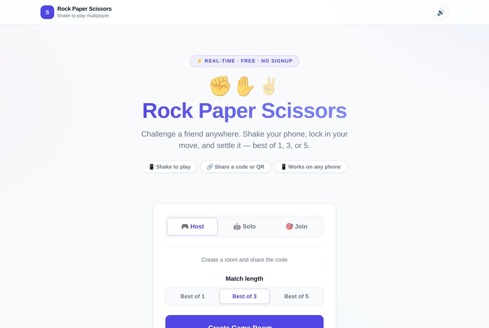
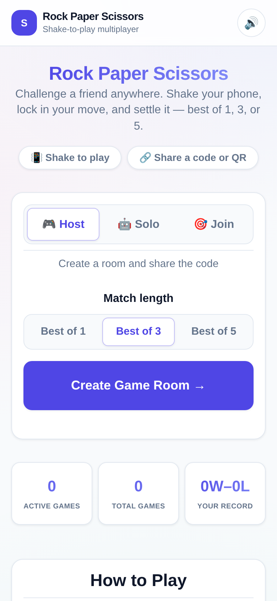
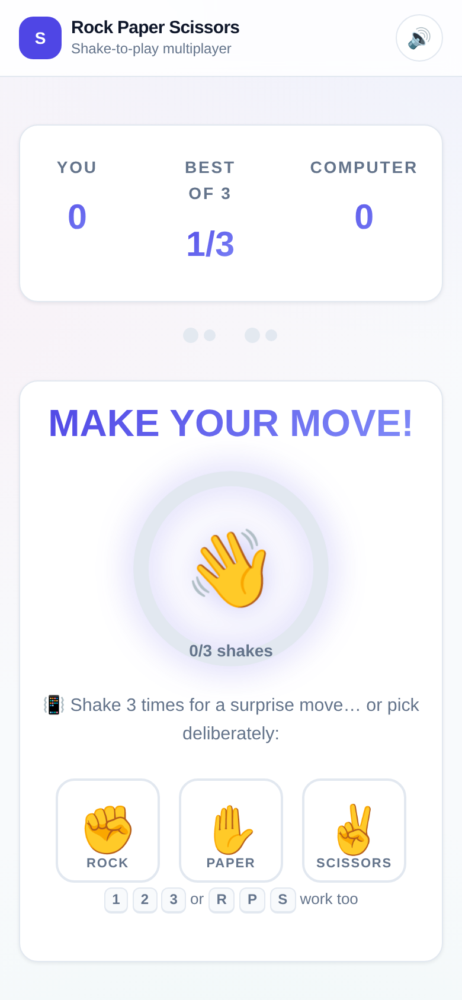

# Rock Paper Scissors - Real-time Multiplayer Game

## What it is

A real-time multiplayer Rock Paper Scissors web app with phone shake
detection (gyroscope). One player hosts a game and shares a code or QR
code; the other joins from their phone. Both players shake to make a
choice (or use the manual fallback buttons), and the app plays out a
best-of-1/3/5 match with live polling for game state.

## Screenshots

| Home (desktop) | Home (mobile) | Gameplay (mobile) |
|---|---|---|
|  |  |  |

## Stack

- **Backend**: FastAPI (async), served by Gunicorn + `uvicorn.workers.UvicornWorker`
- **Database**: SQLite (`data/scissors.db`), accessed via `aiosqlite`, WAL mode
- **Frontend**: Jinja2 templates, Alpine.js (vendored at `app/static/js/alpine.min.js`, pinned 3.14.9), custom CSS
- **Styling**: hand-rolled CSS (no Tailwind/build step) to keep its own visual identity
- **Sessions**: Starlette `SessionMiddleware` (signed cookie, itsdangerous)
- **Background jobs**: APScheduler (`AsyncIOScheduler`) — cleans up expired "waiting" games every minute
- **QR codes**: `qrcode` + Pillow, generated on the fly (no external storage)
- **Tests**: pytest + pytest-asyncio + httpx `ASGITransport`/`AsyncClient`

Previously Flask + gevent + Supabase (Postgres via PostgREST); migrated to
FastAPI + SQLite (see Migration notes below).

## Architecture

```
scissors/
├── app/
│   ├── main.py               # FastAPI app, middleware, routers, error handlers
│   ├── config.py              # pydantic-settings Settings, reads .env
│   ├── db.py                   # aiosqlite connection helper + schema init
│   ├── models.py               # Game / Round / Statistics (raw SQL)
│   ├── templating.py           # Jinja2Templates + ROOT_PATH-aware url_for()
│   ├── routers/
│   │   ├── game.py             # Page routes: index, create/view/cancel/join game
│   │   ├── api.py              # JSON API: stats, game state, shake, choice, react, play-again
│   │   ├── ws.py               # WebSocket /ws/game/{code} - "state changed" pokes
│   │   └── admin.py            # HTTP Basic-protected admin dashboard + JSON endpoints
│   ├── services/
│   │   ├── game_service.py     # Core game rules (round/game winner logic)
│   │   ├── game_events.py      # In-process pub/sub feeding the WebSocket
│   │   └── qr_service.py       # QR code + join URL generation
│   ├── utils/
│   │   ├── helpers.py          # Game code gen, winner logic, formatting
│   │   ├── rate_limit.py       # SQLite sliding-window rate limiter (game creation)
│   │   └── scheduler.py        # APScheduler setup (expired-game cleanup)
│   ├── static/                 # css/, js/ (shake.js, effects.js, share-card.js, admin.js, alpine.min.js), images/
│   ├── logs/                   # access.log + app.log at runtime (.gitkeep tracked)
│   └── templates/              # base.html + page templates
├── data/                        # scissors.db (gitignored, www-data writable)
├── db/schema.sql                 # canonical SQLite schema (checked in)
├── tests/                        # pytest suite (118 tests)
├── gunicorn.conf.py
├── requirements.txt              # fully pinned
├── .env / .env.example
├── .gitignore
└── LICENSE
```

## Run locally

```bash
git clone https://github.com/kudithipudi/scissors.git
cd scissors
python3 -m venv venv
venv/bin/pip install -r requirements.txt
cp .env.example .env   # then edit SECRET_KEY / ADMIN_PASSWORD

# Dev server (auto-reload)
venv/bin/uvicorn app.main:app --reload --port 8000
```

Visit `http://localhost:8000/`. The SQLite DB is created automatically
(schema applied idempotently) at `data/scissors.db` on first startup.

### Run tests

```bash
venv/bin/python -m pytest
```

118 tests cover routes, the API, game logic, rate limiting, security
headers, device/shake detection behavior, the WebSocket channel, and a
full integration game flow against a real (throwaway) SQLite database
per test.

Most tests use httpx `ASGITransport`/`AsyncClient`, which cannot speak the
WebSocket protocol; `tests/test_ws.py` therefore uses Starlette's
synchronous `TestClient` instead.
## Deploy

Runs under Gunicorn (`gunicorn.conf.py`, exactly 1 `UvicornWorker` — see
[Real-time updates](#real-time-updates) below for why) behind a reverse
proxy of your choice. It binds a TCP port by default
(`127.0.0.1:8000`); set `GUNICORN_BIND=unix:/path/to/scissors.sock` in the
process environment if you'd rather front it with a unix socket.

Example systemd unit:

```ini
[Unit]
Description=Rock Paper Scissors FastAPI Application
After=network.target

[Service]
User=www-data
Group=www-data
WorkingDirectory=/path/to/scissors
Environment="PATH=/path/to/scissors/venv/bin"
ExecStart=/path/to/scissors/venv/bin/gunicorn -c gunicorn.conf.py app.main:app

[Install]
WantedBy=multi-user.target
```

```bash
sudo systemctl daemon-reload
sudo systemctl enable --now scissors
sudo systemctl status scissors
curl -s -o /dev/null -w '%{http_code}' https://your-domain.example/   # -> 200
curl -s https://your-domain.example/health                            # -> {"status":"ok"}
```

If you mount the app under a URL prefix (e.g. `/scissors/`), have your
proxy strip that prefix before forwarding and set `ROOT_PATH` to match, so
`app/templating.py` can build correctly-prefixed links back out. An nginx
example:

```nginx
location /scissors/ws/ {
    include proxy_params;
    proxy_http_version 1.1;
    proxy_set_header Upgrade $http_upgrade;
    proxy_set_header Connection "upgrade";
    rewrite ^/scissors(/.*)$ $1 break;
    proxy_pass http://127.0.0.1:8000;   # or unix:/path/to/scissors.sock
}

location /scissors/ {
    include proxy_params;
    rewrite ^/scissors(/.*)$ $1 break;
    proxy_pass http://127.0.0.1:8000;   # or unix:/path/to/scissors.sock
}
```

## Logs

Files under `app/logs/`, not journald:

- `app/logs/access.log` — gunicorn access log (one line per HTTP request)
- `app/logs/app.log` — gunicorn error/boot log plus app output via `logging`

Set `LOG_LEVEL=debug` in `.env` to flip verbosity without code changes.

## Env vars

| Var | Purpose | Default |
|---|---|---|
| `APP_NAME` | App display name (OpenAPI title) | `Rock Paper Scissors` |
| `ROOT_PATH` | URL prefix this app is mounted under, if any (used to build browser-facing links; your proxy must strip it from incoming paths) | `` (none) |
| `DEBUG` | Debug flag | `false` |
| `SECRET_KEY` | Session cookie signing key | dev placeholder — **set a real one in prod** |
| `SESSION_COOKIE_SECURE` | Require HTTPS for the session cookie | `true` |
| `SESSION_COOKIE_MAX_AGE` | Session cookie lifetime, seconds | `86400` (24 h) |
| `DB_PATH` | Path to the SQLite database file | `data/scissors.db` |
| `ADMIN_PASSWORD` | Password for `/admin/*` (HTTP Basic; any username accepted) | dev placeholder — **set a real one in prod** |
| `SITE_LINK_URL` | Optional "powered by" link URL shown in the header/footer | unset (link hidden) |
| `SITE_LINK_LABEL` | Label for `SITE_LINK_URL` | falls back to the URL itself |
| `GAME_TIMEOUT_MINUTES` | Minutes before an unjoined "waiting" game expires | `2` |
| `MAX_GAMES_PER_IP_PER_HOUR` | Game-creation rate limit per client IP (sliding window, honors `X-Forwarded-For`) | `10` |
| `RATE_LIMIT_WINDOW_SECONDS` | Rate-limit sliding window length, seconds | `3600` |
| `SHAKE_THRESHOLD` | Accelerometer magnitude (m/s²) counted as a shake | `15` |
| `REQUIRED_SHAKES` | Shakes needed to lock in a choice | `3` |
| `SHAKE_TIMEOUT_MS` | Minimum gap between two counted shakes, ms (debounce) | `1000` |
| `QR_BOX_SIZE` | QR code box size (px per module) | `10` |
| `QR_BORDER` | QR code border (modules) | `4` |
| `LOG_LEVEL` | App + gunicorn log level (`debug`/`info`/...) | `info` |

## Game flow

1. **Host creates a game** — picks best of 1/3/5, gets a game code + QR code, waits for a guest.
2. **Guest joins** via QR code or game code — game becomes "active".
3. **Gameplay** — both players pick a move: tap ✊/✋/✌️ (or keyboard `1/2/3`, `R/P/S` on desktop) for a deliberate choice, or shake the phone 3× to let fate pick at random. Choices are revealed once both are in; round winner is computed server-side.
4. **Game completion** — once one side reaches the required round wins, the game is marked "completed"; the host can start a rematch with the same settings.

Background cleanup (APScheduler, every minute) cancels "waiting" games
that expired before a guest joined.

### Real-time updates

The game page polls `/api/game/{code}/state` (every 2 s, plus every 1.2 s
while waiting on an opponent's move) and *additionally* opens a WebSocket
to `/ws/game/{code}`. The socket never carries game state — it only pushes
`{"type": "state"}` when something changed, which makes the client refetch
immediately instead of waiting for the next poll tick, so a round reveals
with no visible lag. Polling is left running untouched as the fallback: if
the socket never connects, drops, or a poke is dropped, everything still
works, just with the old latency.

`app/services/game_events.py` is the in-process pub/sub behind this
(`asyncio.Queue` per subscriber, nothing persisted). This is only safe
because gunicorn runs exactly **one** worker — see `gunicorn.conf.py`. If
that ever becomes more than one worker, the socket would only see events
raised by its own worker and would need a real broker.

The same channel carries ephemeral emoji reactions
(`POST /api/game/{code}/react`, fixed allowlist, in-memory ~1/2 s per
player rate limit, never written to the database).

**Your reverse proxy must be configured to proxy the WebSocket upgrade**
for the `/ws/` path (`proxy_http_version 1.1` plus the `Upgrade` /
`Connection` headers, as in the nginx example above). Without it the
socket simply never connects and the app silently falls back to polling.

## Security & reliability

- **Rate limiting** — game creation (`/game/create` and the "play again"
  endpoint) is limited to `MAX_GAMES_PER_IP_PER_HOUR` games per IP per
  `RATE_LIMIT_WINDOW_SECONDS` (sliding window, SQLite-backed). Returns `429`.
- **Security headers** — every response carries `X-Content-Type-Options:
  nosniff`, `X-Frame-Options: DENY`, `Referrer-Policy:
  strict-origin-when-cross-origin`, and a locked-down `Permissions-Policy`
  that still allows `accelerometer`/`gyroscope`/`magnetometer` for the app's
  own origin so shake detection keeps working.
- **SQLite concurrency** — connections set `PRAGMA busy_timeout = 5000` (and
  use a 10s connect timeout) to avoid `database is locked` errors when both
  players submit around the same time.

## Admin dashboard

`/admin/`, protected by HTTP Basic auth using `ADMIN_PASSWORD`. Shows live
stats, a filterable game list, and per-game round detail.

## Device detection & motion sensors

Unchanged from the original design — see `app/static/js/shake.js` and the
`/device-test` / `/device-simple-test` diagnostic pages. iOS 13+ requires
an explicit user-gesture-triggered permission prompt for
`DeviceMotionEvent`; Android auto-grants. Desktop and denied/unsupported
devices fall back to tap-to-choose buttons, which are always available as
the deliberate way to play (and double as an accessibility fallback).

## UX details

- **Dark mode** — automatic via `prefers-color-scheme`; theme-color meta
  follows the scheme.
- **Sound & haptics** — tiny WebAudio-synthesized effects (no assets) plus
  vibration where supported; toggleable from the header (🔊), persisted in
  `localStorage`.
- **Confetti** — canvas confetti celebrates a match win; all motion respects
  `prefers-reduced-motion`.
- **Resilience** — a "Reconnecting…" pill appears if state polling fails
  repeatedly; the tab title tracks game status. The WebSocket reconnects on
  its own with 1s→2s→4s→…→10s backoff, and stops once the game is over.
- **Shake feedback** — the progress ring and the sound/haptics escalate with
  each shake; the three `SHAKE_*` env vars above actually drive the
  client-side detector (they used to be ignored — `shake.js` had them
  hardcoded).
- **Share card** — the completed-game screen can render the result to a
  600×800 canvas (`app/static/js/share-card.js`) and hand it to
  `navigator.share`, falling back to a download and then to copying a plain
  text summary.
- **Local record** — wins/losses/streak live in `localStorage` under
  `rps-stats` and are shown on the landing page and the result screen. There
  are still no accounts: nothing is sent to or stored on the server.

## Migration notes (Flask+Supabase -> FastAPI+SQLite)

- All Supabase/Postgres usage (2 tables: `vs_games`, `vs_rounds`) was
  replaced with SQLite (`db/schema.sql`), accessed via a single async
  `app/db.py` module. UUIDs are now generated in Python; timestamps are
  UTC ISO-8601 strings generated in Python (not DB defaults).
- Flask blueprints -> FastAPI `APIRouter`s; Flask sessions -> Starlette
  `SessionMiddleware` (same itsdangerous-signed-cookie approach).
  `Flask-Caching` was unused in the original code (never actually
  decorated any route) and was dropped rather than replaced.
- Gunicorn now runs a `uvicorn.workers.UvicornWorker` instead of `gevent`.
- No production Supabase data was migrated: games are short-lived by
  design (2-minute join window; completed/cancelled games aren't kept
  for anything besides admin stats), and the Supabase project's hostname
  was unreachable from this deploy host at migration time (stale/expired
  project — also the cause of recurring `cleanup_expired_games` errors in
  the old logs), so there was nothing to safely pull over.

## License

MIT — see [LICENSE](LICENSE).
